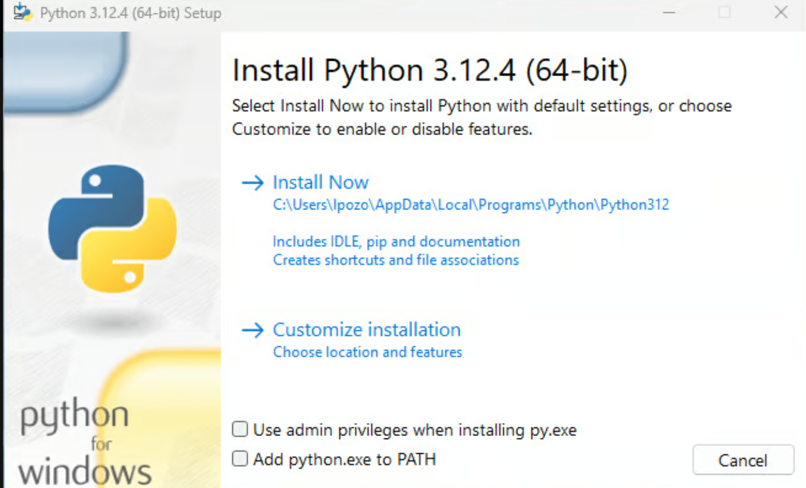

# Python programs   

## How to install python

## Step 1: Download the Official Python Installer
Follow the steps below to download the official Python installer from the Python.org site:

1. Open your browser and navigate to the downloads page for Windows on Python.org.

2. Under the Python Releases for Windows heading, click the link for the Latest Python 3 Release - Python 3.x.z.

3. Scroll to the bottom and select either Windows installer (64-bit) or Windows installer (32-bit).
If you aren’t sure whether to select the 32-bit or the 64-bit installer, then you can expand the box below to help you decide.

<strong>32-bit vs 64-bit Python?</strong>

For Windows, you can choose either the 32-bit or the 64-bit installer. Here’s the difference between the two:

- If your system has a **32-bit processor**, choose the **32-bit installer**.
- On a **64-bit system**, either installer will work, but:
  - **32-bit** uses less memory
  - **64-bit** performs better for intensive computation

If you’re unsure which version to pick, go with the **64-bit version**.

## Step 2: Run the Python Installer

Once you’ve chosen and downloaded an installer, run it by double-clicking on the file.
An installation wizard like the one below will appear on your screen:

> ⚠️ **Important**
>
> Make sure to check **Add python.exe to PATH** before clicking **Install Now**.

<strong>32-bit vs 64-bit Python</strong>

- Use **32-bit** only if your system is 32-bit
- Use **64-bit** for better performance on modern systems

### List of programs
1. [1.py](1.py)

2. [2.py](2.py)

3. [3.py](3.py)

4.  [4.py](4.py)

5.  [5.py](5.py)

6.  [6.py](6.py)

7.  [7.py](7.py)

8.  [8.py](8.py)

9.  [9.py](9.py)

10. [10.py](10.py)

11. [11.py](11.py)

12. [12.py](12.py)

13. [13.py](13.py)

14. [14.py](14.py)

15. [15.py](15.py)

16. [16.py](16.py)

17. [17.py](17.py)

18. [18.py](18.py)

19. [19.py](19.py)

20. [20.py](20.py)

21. [21.py](21.py)

22. [22.py](22.py)

23. [23.py](23.py)

24. [24.py](24.py)

25. [25.py](25.py)

26. [26.py](26.py)

27. [27.py](27.py)

28. [28.py](28.py)

29. [29.py](29.py)

30. [30.py](30.py)

31. [31.py](31.py)

32. [32.py](32.py)

33. [33.py](33.py)

34. [34.py](34.py)

35. [35.py](35.py)

36. [36.py](36.py)

37. [37.py](37.py)

38. [38.py](38.py)

39. [39.py](39.py)

40. [40.py](40.py)

41. [41.py](41.py)

42. [42.py](42.py)

43. [43.py](43.py)

44. [Complex.py](Complex.py)

45. [Complex1.py](Complex1.py)

46. [demo.py](demo.py)

47. [Dict.py](Dict.py)

48. [Dict1.py](Dict1.py)

49. [Forloop.py](Forloop.py)

50. [IO2.py](IO2.py)

51. [IO3.py](IO3.py) 

52. [IOappend.py](IOappend.py)

53. [IOdelete.py](IOdelete.py)

54. [IOwrite.py](IOwrite.py)

55. [IO.py](IO.py)

56. [Practice.py](Practice.py)

57. [private.txt](private.txt)

58. [privateatti.py](privateatt.py)

59. [privateatt2.py](privateatti2.py)

60. [Range.py](Range.py)

61. [Recursive.py](Recursive.py)

62. [Set1.py](Set1.py)

63. [set2.py](Set2.py)

